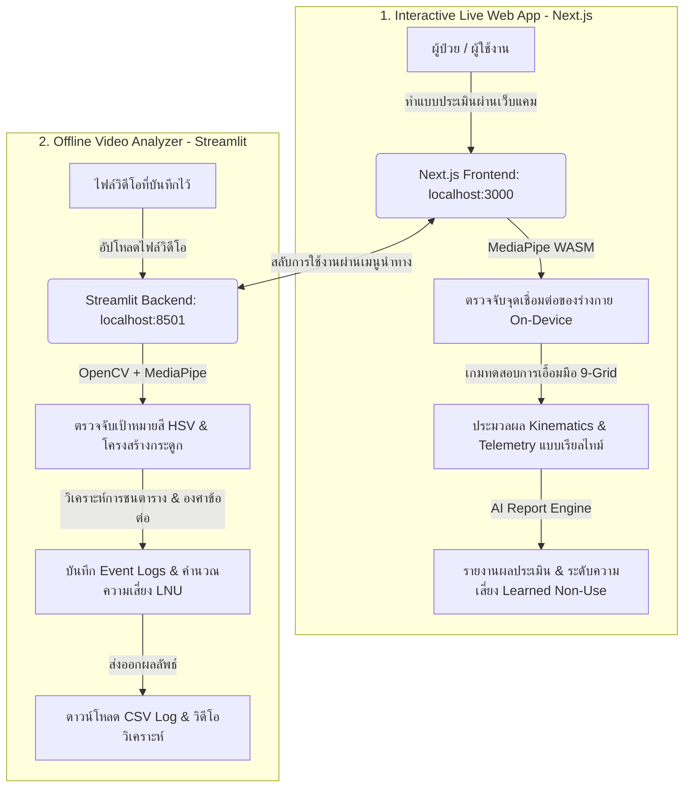

# 🦾 KONKAE (คนแก่) - Dexterity & Sarcopenia Analyzer & Reaching Game

ยินดีต้อนรับสู่โปรเจกต์ **KONKAE.COM (คนแก่)** ระบบวิเคราะห์ความคล่องตัวของมือและภาวะฝืนไม่ใช้งานแขน (Learned Non-Use) เพื่อประเมินความเสี่ยงโรคกล้ามเนื้อฝ่อลีบ (Sarcopenia) และความเสี่ยงต่อการหกล้มในผู้สูงอายุ พัฒนาขึ้นสำหรับการแข่งขัน **Digital Aiding 4 Aging Hackathon** โดย Toto และ King

โปรเจกต์นี้ประกอบไปด้วย 2 ส่วนหลักที่ทำงานร่วมกัน:
1. **Interactive Web App (Next.js)**: ระบบวิเคราะห์แบบ Real-Time ผ่านเว็บแคม ทำงานบนอุปกรณ์ฝั่งผู้ใช้ (On-Device Client) ด้วย MediaPipe WebAssembly
2. **Video Upload Analyzer (Python Streamlit)**: ระบบประมวลผลวิดีโอออฟไลน์ (Offline Video Analyzer) แบบเฟรมต่อเฟรม (Frame-by-Frame Logs) สำหรับวิดีโอที่บันทึกไว้ล่วงหน้า

---

## 📐 สถาปัตยกรรมการทำงาน (System Architecture)



---

## 📂 โครงสร้างโปรเจกต์ (Project Structure)

* **[app.py](file:///d:/vibe-hack-real/sarcopenia-assessment/app.py)**: ซอร์สโค้ดระบบประมวลผลไฟล์วิดีโอออฟไลน์ (Python Streamlit)
* **[web/](file:///d:/vibe-hack-real/sarcopenia-assessment/web)**: ไดเรกทอรีแอปพลิเคชันระบบประเมินเว็บแคม (Next.js)
  * **[web/src/app/page.tsx](file:///d:/vibe-hack-real/sarcopenia-assessment/web/src/app/page.tsx)**: โครงสร้างหลักของหน้า Dashboard ของเกม 9-Grid และการเชื่อมต่ออุปกรณ์
  * **[web/src/components/LiveVision.tsx](file:///d:/vibe-hack-real/sarcopenia-assessment/web/src/components/LiveVision.tsx)**: คอมโพเนนต์จัดการ Web Camera และประมวลผล MediaPipe Pose ผ่าน WebAssembly CDN
  * **[web/src/components/EvaluationDashboard.tsx](file:///d:/vibe-hack-real/sarcopenia-assessment/web/src/components/EvaluationDashboard.tsx)**: ระบบแดชบอร์ดสรุปคะแนนประเมิน รายงานทางคลินิก และแผนการฟื้นฟู
  * **[web/src/app/api/generate-report/route.ts](file:///d:/vibe-hack-real/sarcopenia-assessment/web/src/app/api/generate-report/route.ts)**: API สำหรับคำนวณและสร้างรายงานประเมินความเสี่ยง Learned Non-Use และการหกล้ม (Fall Risk)
  * **[web/package.json](file:///d:/vibe-hack-real/sarcopenia-assessment/web/package.json)**: ข้อมูลไลบรารีและสคริปต์รันของ Next.js

---

## 🚀 ขั้นตอนการติดตั้งและการเริ่มใช้งาน (Setup & Run)

### 1. ระบบวิเคราะห์ผ่านเว็บแคม (Next.js Web App)

ระบบทำงานบน Next.js 16 + React 19 และประมวลผล MediaPipe WASM บนเบราว์เซอร์ของผู้ใช้โดยตรง

#### **ขั้นตอนการเปิดใช้งาน:**
1. ไปที่ไดเรกทอรี `web`:
   ```bash
   cd web
   ```
2. ติดตั้ง Dependencies:
   ```bash
   npm install
   ```
3. รันเซิร์ฟเวอร์สำหรับพัฒนา (Development Server):
   ```bash
   npm run dev
   ```
4. เปิดเบราว์เซอร์ไปที่: **http://localhost:3000**

---

### 2. ระบบวิเคราะห์วิดีโอออฟไลน์ (Streamlit Video Analyzer)

ระบบนี้ใช้สำหรับอัปโหลดไฟล์วิดีโอประเมินผลเพื่อสแกนเฟรมต่อเฟรม เหมาะสำหรับคลินิกหรือนักกายภาพที่ต้องการสแกนวิดีโอที่บันทึกไว้

#### **ความต้องการของระบบ (Prerequisites):**
* **Python 3.11** (แนะนำสำหรับการรองรับ MediaPipe และ OpenCV อย่างเสถียรที่สุดบน Windows)

#### **ขั้นตอนการเปิดใช้งาน:**
1. กลับมาที่โฟลเดอร์ Root ของโปรเจกต์:
   ```bash
   cd ..
   ```
2. สร้าง Virtual Environment และเปิดใช้งาน:
   * **Windows (PowerShell/CMD)**:
     ```bash
     python -m venv .venv
     .venv\Scripts\activate
     ```
   * **macOS / Linux**:
     ```bash
     python3.11 -m venv .venv
     source .venv/bin/activate
     ```
3. ติดตั้งไลบรารีทั้งหมด:
   ```bash
   pip install --upgrade pip
   pip install streamlit opencv-python mediapipe numpy pandas
   ```
4. รันแอปพลิเคชัน Streamlit:
   ```bash
   streamlit run app.py
   ```
5. ระบบจะเปิดให้ใช้งานผ่าน: **http://localhost:8501** โดยอัตโนมัติ

---

## 🌟 ฟีเจอร์หลักของแต่ละระบบ (Detailed System Features)

### 🎮 1. ระบบวิเคราะห์ผ่านเว็บแคม (Next.js Reaching Game)
* **9-Grid Interactive Game**: เกมทดสอบเอื้อมแตะ 9 ช่องบนหน้าจอแบบจับเวลา 90 วินาที เพื่อดูความถูกต้องแม่นยำและทิศทางการเคลื่อนไหวของมือ
* **Posture Calibration System**: ผู้ใช้ต้องยืนวางมือสองข้างในพิกัดบนที่กำหนด (START POSTURE L / R) ค้างไว้เพื่อทดสอบตำแหน่งก่อนเริ่มเกมเพื่อความเที่ยงตรงในการประเมิน
* **Live Kinematics & Telemetry Charts**: พล็อตกราฟสดแสดงความเร็วของการเคลื่อนไหว (px/s), มุมองศาข้อต่อ, ความราบรื่น และ Jitter
* **Learned Non-Use Index (LNI)**: คำนวณอัตราส่วนการสลับใช้แขนและประเมินพฤติกรรมการฝืนไม่ใช้งานแขนข้างที่อ่อนแรง
* **Interactive Evaluation Report & Rehab Plan**: สร้างแผนกายภาพฟื้นฟูเบื้องต้นรายบุคคล และประเมินความเสี่ยงต่อการลื่นหกล้ม (Fall Risk) สามารถพิมพ์ออกเป็นไฟล์เอกสารได้ทันที

### 📼 2. ระบบวิเคราะห์วิดีโอออฟไลน์ (Streamlit Analyzer)
* **Target Box HSV Detection**: ตรวจจับกล่องเป้าหมายสี (เขียว, แดง, น้ำเงิน) จากวิดีโอโดยแปลงพื้นที่สีเป็น HSV และคำนวณพื้นที่ (Area Ratio > 10%) เพื่อลดสัญญาณรบกวนของฉากหลัง
* **Collision Checking State Machine**: สแกนการทับซ้อน (Collision) ระหว่างตำแหน่งข้อมือ/ปลายนิ้ว กับเป้าหมาย โดยตรวจสอบการทาบมือค้างไว้ครบจำนวนเฟรมที่ตั้งค่า (`N` Frames)
* **Arm Elevation Angle & Reps**: วัดมุมไหล่-ข้อศอก-สะโพก และนับจำนวนครั้ง (Reps) ที่ยกแขนสูงกว่า 60 องศา
* **Grid Bounds Preset Adjustments**: แก้ปัญหาวิดีโอติดขอบดำ (Pillarbox/Letterbox) ด้วยการเลือก Grid Preset:
  * *Fit Video Frame*: ตารางเต็มความกว้าง
  * *Center 4:3*: จัดกล่องให้อยู่ตรงกลางวิดีโอขนาด 4:3 (เหมาะกับคลิปทดสอบ `67-R-cut.mp4` / `60-L-cut.mp4`)
  * *Custom Margins*: เลื่อนปรับขอบความกว้างตารางได้ตามความเหมาะสม
* **Export Analyzer Logs**: ดาวน์โหลดไฟล์ CSV แสดงผลวิเคราะห์แบบวินาทีต่อวินาที และดาวน์โหลดไฟล์วิดีโอแบบวาดเส้นจุดเชื่อมโครงร่าง (Annotated Video) กลับไปใช้ประกอบประเมินผลได้

---

## 📊 รายละเอียด Event Logs ที่ประมวลผล (Log Specifications)

ทั้งสองระบบตรวจวัดและสร้างชุดข้อมูลประเมินผลตามรูปแบบมาตรฐานเดียวกันดังนี้:
* `[Frame X] Target Y appeared on [LEFT/CENTER/RIGHT]` (เมื่อเป้าหมายปรากฏตัวบนตาราง)
* `[Frame X] Target Y HIT by [LEFT/RIGHT] Hand` (เมื่อชนเป้าหมายสำเร็จด้วยมือซ้าย/ขวา)
* `[Frame X] Target Y disappeared (MISSED)` (เมื่อเป้าหมายหายไปโดยไม่ถูกเอื้อมแตะ)
* `[Frame X] Left/Right Arm Raise #Z (Angle: A.A)` (เมื่อยกแขนสูงและคำนวณองศา)

---

## 🤝 การพัฒนาต่อยอดย่อย (Developer Guide)

1. **การปรับแต่งช่วงสีในการตรวจจับ (HSV Color Ranges)**:
   สามารถเข้าไปแก้ไขอาร์เรย์ช่วงค่าสีในชุดคำสั่ง `cv2.inRange` บรรทัดที่ `350-362` ในไฟล์ [app.py](file:///d:/vibe-hack-real/sarcopenia-assessment/app.py) หากวิดีโอมีการเปลี่ยนแปลงของแสงไฟในห้องทดสอบ
2. **การเปลี่ยนจุดพิกัดตรวจจับการชน (Tracking Reference Points)**:
   ปรับเปลี่ยนตำแหน่งดัชนีจุดตรวจจับนิ้วมือ/ข้อมือในกลไกของแอป Next.js ได้โดยอ้างอิงรหัสดัชนีของ MediaPipe Pose ใน [LiveVision.tsx](file:///d:/vibe-hack-real/sarcopenia-assessment/web/src/components/LiveVision.tsx) และ [kinematics.ts](file:///d:/vibe-hack-real/sarcopenia-assessment/web/src/lib/kinematics.ts)

---
*จัดทำขึ้นโดยทีมพัฒนา **KONKAE** ในการประกวด Digital Aiding 4 Aging Hackathon 🦾*
